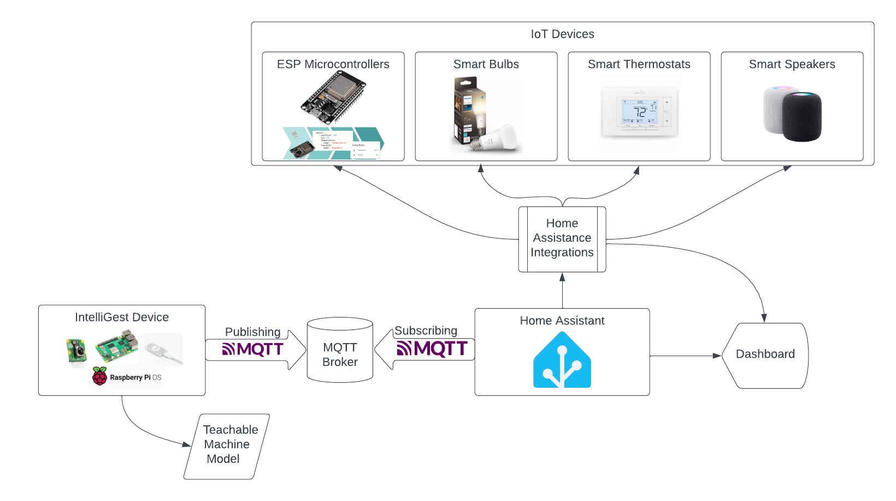

# System Block Diagram

import Figure from "../../src/components/Figure";
<Figure caption={"Figure 1. High-level design of the IntelliGest System application."}>

</Figure>

Figure 1 depicts the high-level design of the product. The user will be able to set up the IntelliGest Device and connect to devices around their smart home. The device will already have Home Assistant installed and set up with MQTT and a MQTT Broker Server, as well as a teachable machine learning model. The user can then use the camera on the device to trigger a MQTT protocol to publish the request of the user to the subscribed Home Assistant, which will then handle the action requested. The display will connect to Home Assistant and the integration to show the user all of their connected devices and any changes being made to them.
