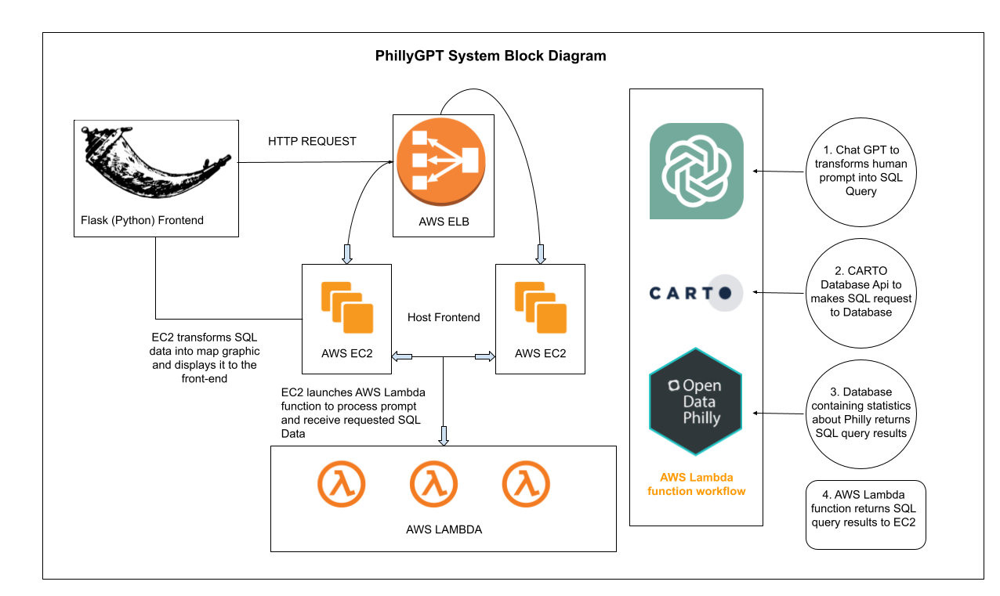

**Purpose**

This document outlines the architecture for our web application, designed to convert natural language queries into SQL statements. Leveraging technologies like Node.js for the backend, Python for interfacing with OpenAI's ChatGPT, and other tools such as AWS Lambda and Carto's SQL API, our goal is to democratize access to database querying. This project aims to bridge the gap between complex data manipulation and user-friendly interactions, enabling users to engage with databases through conversational inputs. By detailing the system's structure and workflow, this document serves as a roadmap for the development team, ensuring clarity and coherence in our approach to creating a seamless, intuitive data querying experience.

**Components and Interfaces**
 
Current System Architecure Diagram (work in progress)
- **Client-Side Web Application (Frontend)**
  - For PhillyGPT we will utilize a multitude of different components that will enhance our services providing a seamless experience for users. To create pages we will utilize HTML along with CSS Tailwind for styling. JavaScript will also be used to create dynamic interactions.
  The user interace will allow users to input natural language queries (prompts) which will then return a display of results based on the specific request. The frontend will communicate with the backend via HTTP requests.
- **Application Server (Backend)**
  - PhillyGPT's backend component will consist of a Node.js server which will allow us to execute our Javascript code. A Node.js server will allow PhillyGPT to have an interface that utilizes RESTful API endpoints that accept requests from the frontend, processes them (e.g., converting
    natural language to SQL queries using OpenAI API), and send responses back. This function will also interface with AWS Lambda for executing specific baackend functions and Carto's SQL API for geographical data processing.
- **OpenAI API Integration for SQL Query Generation**
  -  Philly GPT's OpenAI integration will utilize Python in order to send requests to and from OpenAI. This will allow function calls to the OpenAI API with user input and will receive SQL queries as responses. This component acts as a bridge between natural language inputs and database queries.
- **AWS Lambda Functions**
  - In order to improve performance PhillyGPT will utilize serverless functions deployed on AWS Lambda. For our purpose, triggers will activate Lambda functions which can include HTTP requests from the Node.js server. Lambda functions will be able to process data, interact with SQL database, or call external API's and return results.
- **SQL Database**
  - PhillyGPT's SQL database will consist of a database schema and tables. This will allow SQL commands for querying and manipulating data. This database will be accessed by the backend server or AWS Lambda functions to retrieve data based on SQL queries.
- **Carto's SQL API Integration**
  - For geographical purposes PhillyGPT will utilize code that makes HTTP requests to Carto's SQL API for executing SQL queries on spatial data. API requests to Carto's SQL API endpoint will be made by passing SQL queries and receiving query results in JSON format. 

**Requirements**

In addition to the general requirements the Design Document - Part I Architecture will contain:

A description the different components and their interfaces. For example: client, server, database.

For each component provide class diagrams showing the classes to be developed (or used) and their relationship.

Sequence diagrams showing the data flow for _all_ use cases. One sequence diagram corresponds to one use case and different use cases should have different corresponding sequence diagrams.

Describe algorithms employed in your project, e.g. neural network paradigm, training and training data set, etc.

If there is a database:

Entity-relation diagram.

Table design.

A check list for architecture design is attached here [architecture\_design\_checklist.pdf](https://templeu.instructure.com/courses/106563/files/16928870/download?wrap=1 "architecture_design_checklist.pdf")  and should be used as a guidance.
