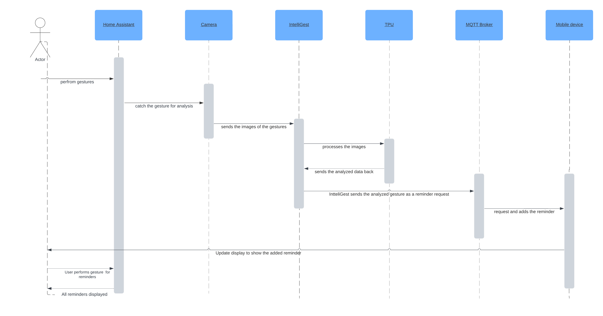

import Figure from "../../src/components/Figure";

# Sequence Diagrams

## Use Case 1: Light Control through ASL Gestures

<Figure caption={"Use Case 1. Light Control through ASL Gestures"}>

</Figure>

## Use Case 2: Weather Seeking through Gestures

<Figure caption={"Use Case 2. Weather Seeking through Gestures"}>

</Figure>

## Use Case 3: Changing Kitchen Light Color

<Figure caption={"Use Case 3. Changing Kitchen Light Color"}>

</Figure>

## Use Case 4: Smart Lock Setup and Control

<Figure caption={"Use Case 4. Smart Lock Setup and Control"}>

</Figure>

## Use Case 5: Adding Reminders through Gestures

<Figure caption={"Use Case 6. Adding Reminders through Gestures"}>

</Figure>

## Use Case 6: Temperature Adjustments with ASL

<Figure caption={"Use Case 6. Temperature Adjustments with ASL"}>

</Figure>

## Use Case 7: Changing TV Channels

<Figure caption={"Use Case 7. Changing TV Channels"}>

</Figure>
