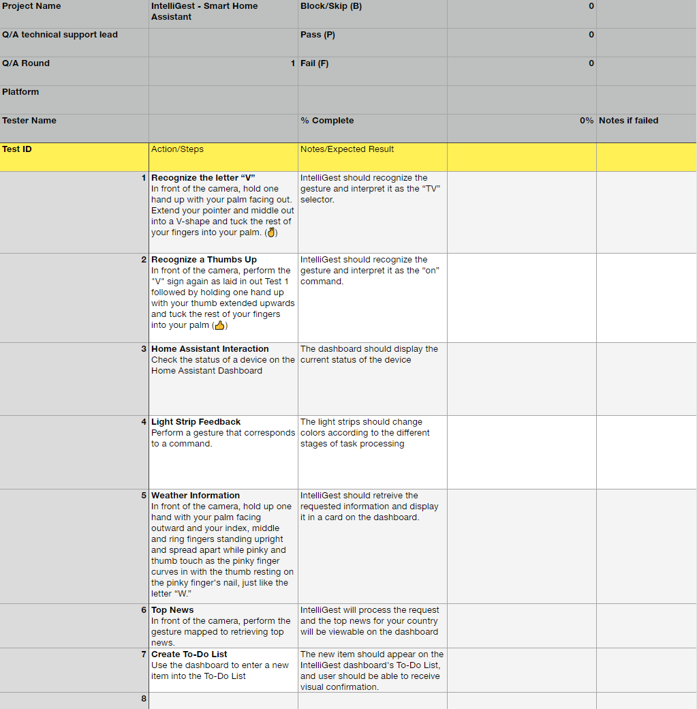

import Figure from "../../src/components/Figure";

# Acceptance test

<Figure caption={"An Acceptance Testing Sheet we will use for testing."}>

</Figure>

Download the Acceptance Testing Sheet [here](documentation/static/files/AcceptanceTesting.xlsx)
